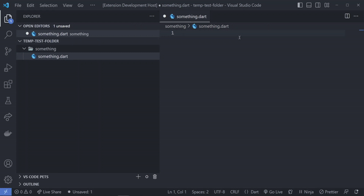
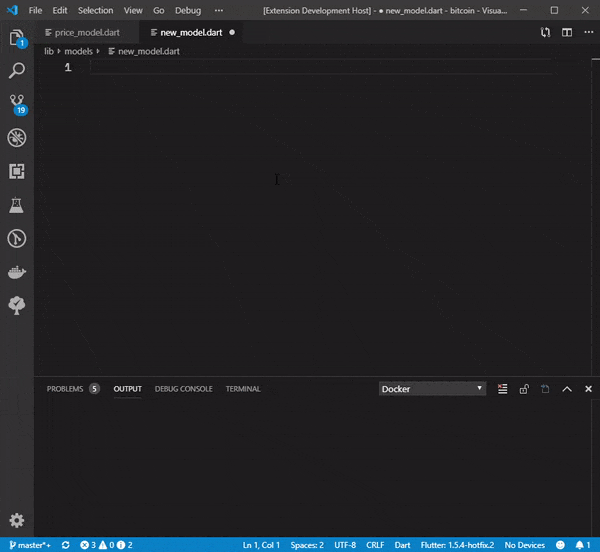
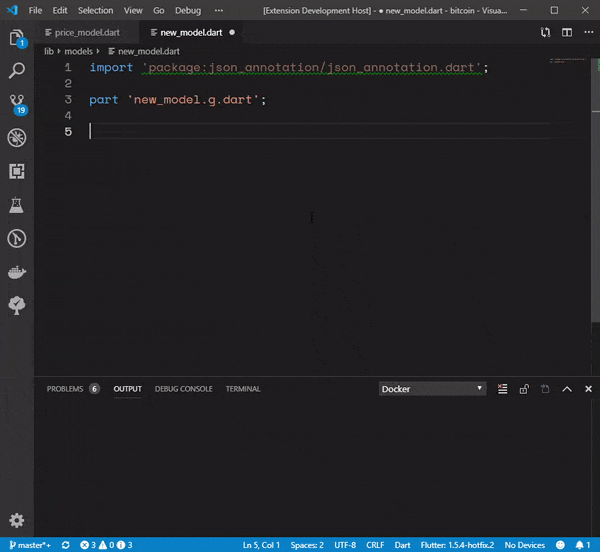
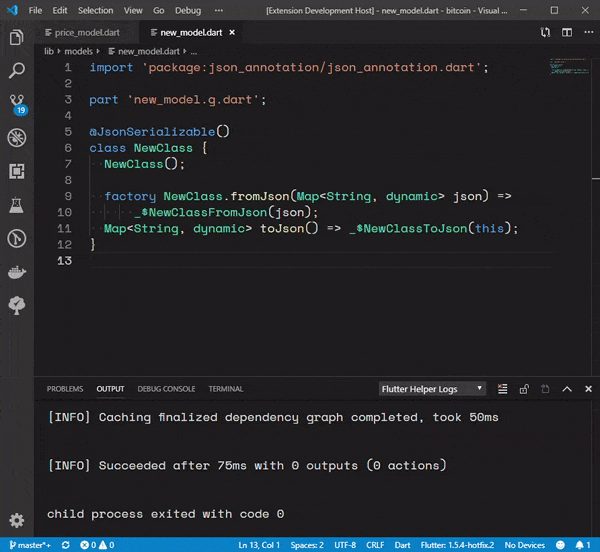
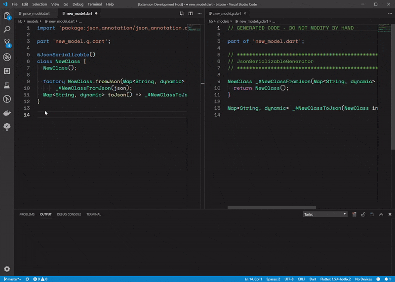

# Flutter Helpers VSCode Extension

This extension currently helps you to easily write JSONSerializable annotated classes and allows you to run code generation for those classes. You can also watch the files so that code generation is faster.

## Setup your flutter project for code generation for JSONSerializable annotations

In your pubspec.yaml file add the following libraries in the `dev_dependencies` and `dependencies` section:

```
dev_dependencies:
    // ...
    build_runner: ^1.0.0
    json_serializable: ^3.0.0

dependencies:
    // ...
    json_annotation: ^2.4.0
```

## Features

### Snippet for setting up a file with JSONSerializable annotated classes and creating JSONSerializable annotated model: `jsi`



### Snippet for setting up a file with JSONSerializable annotated classes: `jsf`



### Snippet for creating JSONSerializable annotated model: `jsc`



### Run Code Gen for JSONSerializable annotated classes



### Have build runner watch the JSONSerializable annotated classes and generate code on changes


